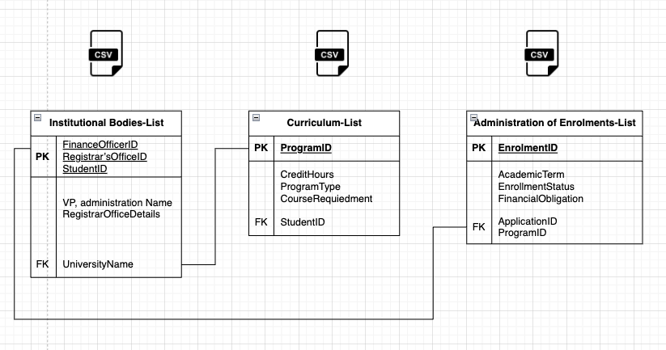
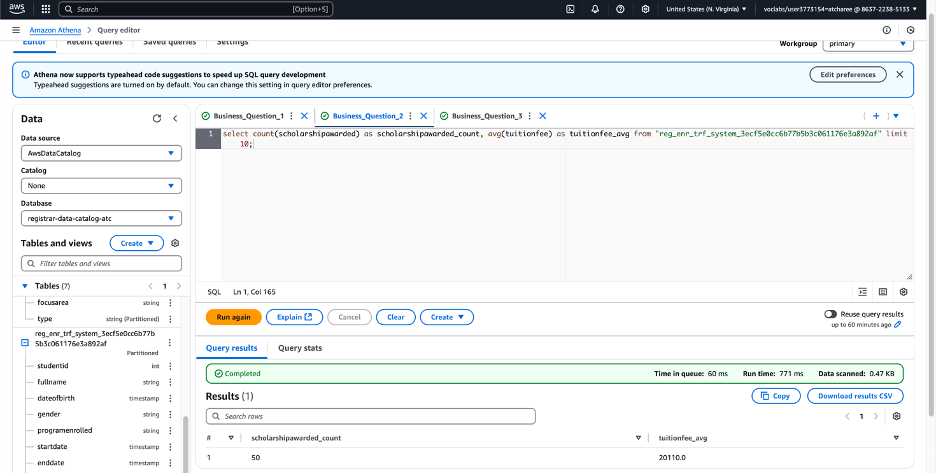

# 📊 Descriptive Analysis of Operational Dataset of UCW's Policies Using AWS Services 📊

## 🟡 Project Description
This project seeks to explore and enhance operational data quality through a comprehensive analysis of the UCW policies dataset. By leveraging powerful AWS services, the primary aim is to conduct a detailed descriptive analysis, focusing on exploring the Entity-Relationship (ER) diagram and the operational intricacies. Using AWS resources such as S3, Glue, DataBrew, and CloudWatch, the project optimizes data storage, cleansing, profiling, and transformation processes to ensure seamless data insights. The strategic implementation of these services aims to streamline data workflows and generate valuable insights for business optimization.

## 🟡 Objective
The objective of this project is to enhance operational data through efficient cleaning, transformation, and analysis using AWS services. Key challenges such as missing data, outlier detection, and data inconsistencies are addressed to refine data quality. Ultimately, the goal is to provide meaningful, actionable insights that support critical business decisions and improve operational efficiency.

## 🟡 Dataset
The dataset consists of CSV files containing critical information such as University Name, Program ID, Student ID, Program Type, Enrolment ID, and Application ID. The data is stored securely in Amazon S3 and processed with AWS Glue DataBrew to perform necessary cleaning and transformations before being analyzed for business intelligence.

## 🟡 Methodology

### ▶️ 1. Data Ingestion
The initial phase involves securely uploading data to Amazon S3, ensuring the storage solution offers both high durability and availability for effortless access and management.

### ▶️ 2. Data Profiling
Utilizing AWS Glue DataBrew, the data undergoes a rigorous profiling process. This includes identifying missing values, inconsistencies, and detecting outliers within the dataset to ensure its integrity.

Lifecycle Configuration in Amazon S3 Buckets to manage objects so it will store effectlively throughtout it lifecycle.

Generating virtual server on AWS EC2 Instances to isolate specific services, allocate computing resources based on the specific needs of each service in otder to optimize web traffic and ensure better security and scalability.

### ▶️ 3. Data Cleaning
In this phase, missing values and data inconsistencies are resolved through imputation or removal techniques, ensuring a refined dataset that meets business requirements.

### ▶️ 4. Data Transformation
Following the cleaning phase, the data is transformed into a consistent format, facilitating smooth integration and further analysis, ensuring the dataset aligns with business needs.

### ▶️ 5. Data Summarization
AWS Glue’s Visual ETL tool is used to summarize key data insights in a clear, concise manner. This process distills complex data into understandable, actionable insights for stakeholders.

### ▶️ 6. Data Analysis
Data Analysis will use for generate insights and reports. In this report will use Amazon Athena with SQL integrating to solve the Business Question.

### ▶️ 7. Data Security
AWS Key Management Service (KMS) would use for manage encrypt and decrypt key to ensure all data will secure.

### ▶️ 8. Data Governance
AWS Glue was used in this step by adding condition to do a quality check before analysis. Moreover, it will improve the data quality to make informed decision in the future project.

### ▶️ 9. Data Monitoring
AWS CloudWatch would used to monitor resource usage and computer performance, On top of that, the system will send a alert to data team if the resource is exceeding the threshold, so the data team has to take action for this issue.

## 🟡 Tools and Technologies

### ▶️ 1. AWS S3
Used for the secure and scalable storage of raw and processed datasets, ensuring reliable data accessibility.+

### ▶️ 2. AWS EC2
Provide secure, resizable compute capacity in the cloud, allow users to launch and manage virtual servers for various workloads and applications.

### ▶️ 3. AWS Glue
This managed ETL (Extract, Transform, Load) service facilitates data cleaning, transformation, and cataloging, helping to streamline data workflows.

### ▶️ 4. AWS Glue DataBrew
A no-code tool for data profiling and preparation, AWS Glue DataBrew empowers users to clean and transform datasets quickly with minimal technical knowledge required.

### ▶️ 5. AWS Lambda
Employed to automate various data processing tasks, AWS Lambda ensures smooth and efficient execution of functions within the data pipeline.

## 🚀 Deliverables

### ▶️ 1. Cleaned and Transformed Dataset
The project will deliver a fully cleaned and transformed dataset, primed for insightful analysis.

### ▶️ 2. Understanding of Data Analysis Process
A comprehensive understanding of the data analysis process will be developed, with detailed documentation of the AWS resources and techniques used.

### ▶️ 3. Final Analysis Report
A report will be generated, highlighting significant trends, patterns, and insights derived from the descriptive analysis of the dataset, tailored to provide valuable business intelligence.

### ▶️ 4. Visualizations for Stakeholders
Interactive visualizations and dashboards will be created, offering clear insights and helping stakeholders understand key data trends and decision-making points.

---

*Thank you for visiting my project! For any questions, feel free to reach out via [email](mailto:your-email@example.com) or visit my [LinkedIn profile](https://www.linkedin.com/in/your-linkedin).*
